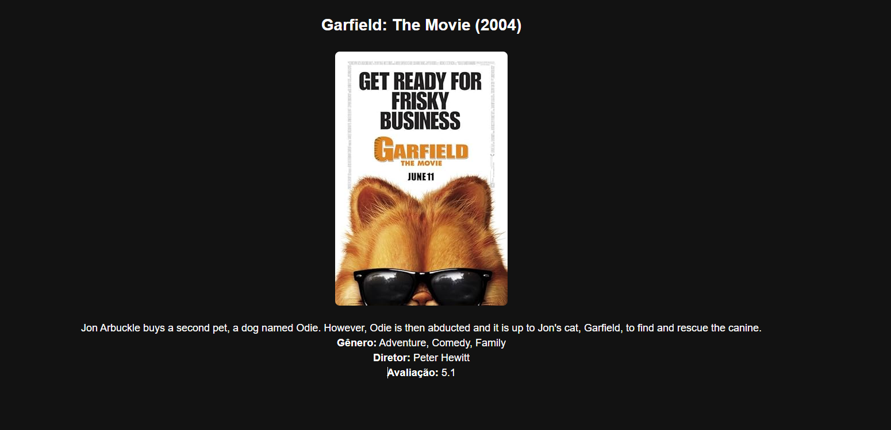
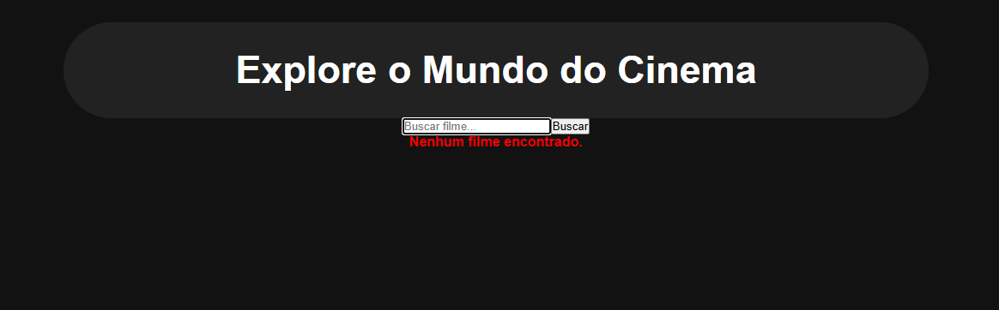

# Buscador de Filmes 🎬

Um projeto desenvolvido em **React + TypeScript** que permite buscar informações sobre filmes através de uma API. O objetivo é oferecer uma experiência rápida e intuitiva para encontrar detalhes sobre filmes.

## 🖥️ Tecnologias Utilizadas
- React
- TypeScript
- Vite
- CSS puro
- API de filmes (OMDb API)

## 🚀 Como Executar o Projeto

### 1️⃣ Clonar o Repositório
```bash
git clone https://github.com/Tiago-JCL/buscador-filmes.git
cd buscador-filmes
```

### 2️⃣ Instalar Dependências
```bash
npm install
```

### 3️⃣ Criar Arquivo `.env.local`
No diretório raiz do projeto, crie um arquivo `.env.local` e adicione sua chave da API OMDb:
```
VITE_OMDB_API_KEY=SUA_CHAVE_AQUI
```

### 4️⃣ Rodar o Projeto
```bash
npm run dev
```
Agora, acesse `http://localhost:5173` no navegador. 🎥

## 📸 Capturas de Tela

  
##
 
## 
  

## 📌 Funcionalidades
✅ Busca dinâmica de filmes 📽️
✅ Exibição de detalhes dos filmes 🎭
✅ Layout responsivo 📱💻
✅ Tratamento de erros 🚧

## 🛠️ Como Contribuir
1. **Fork** o repositório 🍴
2. Crie uma **branch** com sua feature (`git checkout -b minha-feature`) 🌿
3. Faça o **commit** das mudanças (`git commit -m 'Adiciona nova funcionalidade'`) 📌
4. Faça o **push** para sua branch (`git push origin minha-feature`) 🚀
5. Abra um **Pull Request** ✅

## 📜 Licença
Este projeto está licenciado sob a **MIT License**. Sinta-se à vontade para usá-lo e contribuir! 💡

---
Feito com ❤️ por [Tiago José](https://github.com/Tiago-JCL)

